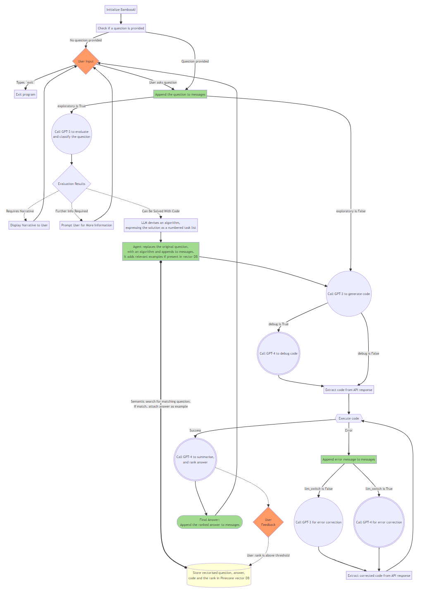

# BambooAI
A lightweight library that leverages Language Models (LLMs) to enable natural language interactions, allowing you to converse with your pandas DataFrames.

## Objective

The BambooAI library is a user-friendly tool designed to make data analysis more accessible to non-programmers. Utilizing the power of Large Language Models (LLM), BambooAI can comprehend your questions about a dataset and automatically generate and execute the appropriate Python code for both analysis and plotting. Users can effortlessly gain valuable insights from their data without writing complex code or mastering advanced programming techniques. With BambooAI, simply input your dataset, ask questions in plain English, and receive answers along with relevant out of the box visualizations if asked for to help you better understand your data.

My main goal was to create a tool to help analysts at all levels, not to replace them. This library makes data analysis and visualization easier, helping to improve workflows. It's designed to be easy to use, efficient, and adaptable to different users' needs. As a supportive tool, not the main operator, it helps users apply their own analytical skills more effectively and increase their productivity.

## Preview

Try it out in Google Colab:

[](https://colab.research.google.com/drive/1grKtqKD4u8cVGMoVv__umci4F7IU14vU?usp=sharing)

https://github.com/pgalko/BambooAI/assets/39939157/2d8e4a9f-29c4-438b-8c13-126a05065ef8

## How it works

The BambooAI agent operates through several key steps to interact with users and generate responses:

**1. Initiation**
- The user starts the BambooAI agent.
- If there's no input question, the agent prompts the user to either input a question or type 'exit' to terminate the program.

**2. Task Evaluation**
- The agent stores the received question and utilizes the Language Learning Model (LLM) to evaluate and categorize it.
- The LLM determines whether the question necessitates a narrative response, additional information, or can be resolved using code.

**3. Dynamic Prompt Build**
- If code can resolve the question, the agent formulates an algorithm expressed as a task list.
- The original question is modified to align with this algorithm. The agent conducts a semantic search for similar questions.
- Any matching questions found are appended to the prompt as examples, and GPT-3 is used to generate code based on the algorithm.

**4. Debugging, Execution, and Error Correction**
- If the generated code needs debugging, GPT-4 is engaged.
- The code is executed, and if errors occur, the agent logs the error message and refers it to the LLM (GPT-3 or GPT-4, depending on the settings) for correction.
- This process continues until successful code execution.

**5. Results, Ranking, and Knowledge Base Build**
- Post successful execution, GPT-4 is used to rank the answer.
- If the rank surpasses a set threshold, the question, answer, code, and rank are stored in the Pinecone vector database.
- Regardless of the rank, the final answer or visualization is formatted and presented to the user.

**6. Human Feedback and Loop Continuation**
- The agent seeks feedback from the user.
- If the user validates the auto-generated ranking, the question/answer pair is stored in the vector database.
- If not, a new execution loop begins.

Throughout this process, the agent continuously solicits user input, stores messages for context, and generates and executes code to ensure optimal results. Various AI models and a vector database are employed in this process to provide accurate and helpful responses to user's questions.

 
**Flow chart:**



## How to use

**Installation**

```
pip install bambooai
```

**Usage**

Parameters

```
df: pd.DataFrame - Dataframe(Required)

max_conversations: int - Number of "user:assistant" conversation pairs to keep in memory for a context. Default=2

llm: str - Base LLM model. Default = gpt-3.5-turbo-0613

llm_switch: bool - If True, the agent will switch to gpt-4 after error

debug: bool - If True, the received code is sent back to the Language Learning Model (LLM) for an evaluation of its relevance to the user's question, along with code error checking and debugging.

vector_db: bool - If True, each answer will first be ranked from 1 to 10. If the rank surpasses a certain threshold (8), the corresponding question (vectorised), answer, code, and rank (metadata) are all stored in the Pinecone database. Each time a new question is asked, these records will be searched. If the similarity score is above 0.9, they will be offered as examples and included in the prompt (in a one-shot learning scenario)

exploratory: bool - If True, the LLM will assess the user's question and create a task list outlining the steps, which will be sent to the LLM as a prompt. This approach is effective for vague user prompts, but may not perform as well with more defined prompts. The default setting is True.


e.g. bamboo = BambooAI(df, debug=True, vector_db=True, llm_switch=True, exploratory=True)
```

Run in a loop

```
# Run in a loop remembering the conversation history
import pandas as pd
from bambooai import BambooAI

df = pd.read_csv('test_activity_data.csv')
bamboo = BambooAI(df)
bamboo.pd_agent_converse()
```
Single execution
```
# Run programaticaly (Single execution).
import pandas as pd
from bambooai import BambooAI

df = pd.read_csv('test_activity_data.csv')
bamboo = BambooAI(df)
bamboo.pd_agent_converse("Calculate 30, 50, 75 and 90 percentiles of the heart rate column")
```
Visualize the data (Uses Matplotlib). Works with both Loop and Single execution

**Environment Variables**

The library requires an OpenAI API account and the API key to connect to OpenAI LLMs. The OpenAI API key needs to be stored in a ```OPENAI_API_KEY``` environment variable.
The key can be obtained from here: https://platform.openai.com/account/api-keys.

The Pincone vector db is optional. If you don want to use it, you dont need to do anything. If you have an account with Pinecone and would like to use the knowledge base and ranking features, you will be required to setup ```PINECONE_API_KEY``` and ```PINECONE_ENV``` envirnoment variables, and set the 'vector_db' parameter to True. The vector db index is created upon first execution.

## Examples

**CLI Output: Prediction of a core temperature using Machine Learning**

*Below is a machine learning example, BambooAI devising, implementing, comparing and finetuning a different Machine learning models to predict a Core Temperature.*


*A plot resulting from the first iteration using MLPRegressor model. No need to copy/paste the matplotlib code. Displays on the fly*


*Now compare to a few other ML models*


*Follow up question for clarification*


A further follow up, asking for clarification


More follow up... Notice the switch to a 16 model as it ran out of 4K window space


Yet more follow up question..


Got sidetracked, and needed a feedback for correction


Final iteration... using the best performing model and tuned hyper parameters. Final R-Squared 0.9166.


## Notes

- The library currently supports only OpenAI Chat models. It has been tested with both gpt-3.5-turbo and gpt-4. The gpt-3.5-turbo seems to perform well and is the preferred option due to its 10x lower cost.
- The library executes LLM generated Python code, this can be bad if the LLM generated Python code is harmful. Use cautiously.
- Be sure to monitor your token usage. At the time of writing, the cost per 1K tokens is $0.03 USD for GPT-4 and $0.002 USD for GPT-3.5-turbo. It's important to keep these costs in mind when using the library, particularly when using the more expensive models.
- Supported models: gpt-3.5-turbo, gpt-3.5-turbo-613, gpt-3.5-turbo-16k, gpt-4, gpt-4-0613.

## Contributing

Contributions are welcome; please feel free to open a pull request. Keep in mind that our goal is to maintain a concise codebase with high readability.

## ToDo

- Ongoing work on optimizing the prompts and sanitization of the outputs.
- Add support for aditional LLMs.

