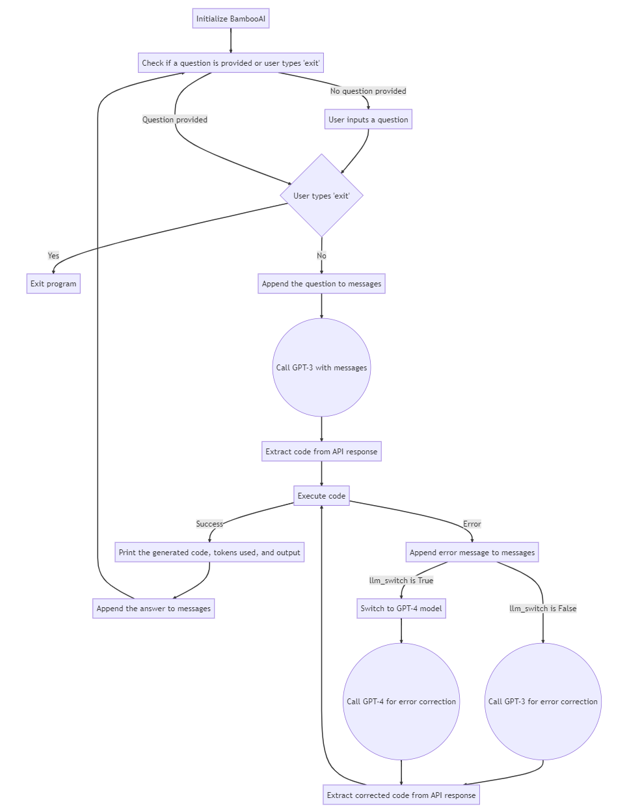

# BambooAI
A lightweight library that leverages Language Models (LLMs) to enable natural language interactions, allowing you to converse with your pandas DataFrames.

## Objective

The BambooAI library is a user-friendly tool designed to make data analysis more accessible to non-programmers. Utilizing the power of Large Language Models (LLM), BambooAI can comprehend your questions about a dataset and automatically generate and execute the appropriate Python code for both analysis and plotting. Users can effortlessly gain valuable insights from their data without writing complex code or mastering advanced programming techniques. With BambooAI, simply input your dataset, ask questions in plain English, and receive answers along with relevant out of the box visualizations if asked for to help you better understand your data.

My aim was to keep the code base under 200 lines of actual code (not counting prompts, comments and blanks) to ensure easy comprehension and clarity for users of various skill levels. By maintaining a concise code base, I strived to create an accessible and straightforward tool that streamlines the process of data analysis and visualization. This approach not only makes it easier for developers and users to understand the library's inner workings but also fosters efficient implementation and customization, catering to a diverse audience and their unique needs.

## Preview

Try it out in Google Colab:

[](https://colab.research.google.com/drive/1grKtqKD4u8cVGMoVv__umci4F7IU14vU?usp=sharing)

https://github.com/pgalko/BambooAI/assets/39939157/2d8e4a9f-29c4-438b-8c13-126a05065ef8

## How it works

- The user begins by starting the BambooAI agent.
- BambooAI subsequently checks if a question has been provided:
  - If a question is available, it continues to the next step.
  - If no question is available, BambooAI prompts the user to input one. It then enters a loop of questions and answers, remembering the conversation history and continually prompting the user for a new question. This loop continues until the user types 'exit', signalling the termination of the program.
- Following the reception of a question, the OpenAI API is called to review and evaluate the task. The Language Learning Model (LLM) then presents a summary in the form of numbered task list.
- The agent then replaces the original question with the task list from the previous step and sends this as a prompt to the OpenAI API for code generation.
- The response from the API, containing the corresponding Python code, is received, checked and sanitised if necessary.
  - If the debug parameter is set to "True", the received code is sent back to the Language Learning Model (LLM) for an evaluation of its relevance to the user's question, along with code error checking and debugging.
- The received code is then executed to generate an answer or a visualization:
  - If the code executes successfully, it displays the answer or visualization and subsequently prompts for another question. This new question could be related to the previous question or could be on an entirely new topic.
  - If an error occurs during code execution, the program requests a corrected version of the code from the OpenAI API by providing the error message, and then attempts to execute the corrected code. *In cases where the "llm_switch" argument is set to "True" (indicating LLM cascading), the program will switch from the base model to the more powerful GPT-4 model for a retry. After successful execution, it will revert to the base model.*
- The program then displays the total token usage at each step, thereby providing insights into the resources consumed during the process.
 
**Flow chart:**



## How to use

**Installation**

```
pip install bambooai
```

**Usage**

Parameters

```
df: pd.DataFrame - Dataframe(Required)

max_conversations: int - Number of "user:assistant" conversation pairs to keep in memory for a context. Default=2

llm: str - Base LLM model. Default = gpt-3.5-turbo

llm_switch: bool - If True, the agent will switch to gpt-4 after error

debug: bool - If True, the received code is sent back to the Language Learning Model (LLM) for an evaluation of its relevance to the user's question, along with code error checking and debugging.

exploratory: bool - If True, the LLM will assess the user's question and create a task list outlining the steps, which will be sent to the LLM as a prompt. This approach is effective for vague user prompts, but may not perform as well with more defined prompts. The default setting is True.

flow_diagram: bool - If True, a mermaid diagram will be generated and displayed to complement the answer.


e.g. bamboo = BambooAI(df, debug=True, llm_switch=True, exploratory=True, flow_diagram=False)
```

Run in a loop

```
# Run in a loop remembering the conversation history
import pandas as pd
from bambooai import BambooAI

df = pd.read_csv('test_activity_data.csv')
bamboo = BambooAI(df)
bamboo.pd_agent_converse()
```
Single execution
```
# Run programaticaly (Single execution).
import pandas as pd
from bambooai import BambooAI

df = pd.read_csv('test_activity_data.csv')
bamboo = BambooAI(df)
bamboo.pd_agent_converse("Calculate 30, 50, 75 and 90 percentiles of the heart rate column")
```
Visualize the data (Uses Matplotlib). Works with both Loop and Single execution

**Environment Variables**

The library requires an OpenAI API account and the API key to connect to an OpenAI LLMs. The OpenAI API key needs to be stored in a 'OPENAI_API_KEY' environment variable.
The key can be obtained from here: https://platform.openai.com/account/api-keys

## Examples

**CLI Output:**


**Google Colab:**


## Notes

- The library currently supports only OpenAI Chat models. It has been tested with both gpt-3.5-turbo and gpt-4. The gpt-3.5-turbo seems to perform well and is the preferred option due to its 10x lower cost.
- The library executes LLM generated Python code, this can be bad if the LLM generated Python code is harmful. Use cautiously.
- Be sure to monitor your token usage, as each execution of BambooAI uses an average of 400-600 tokens. At the time of writing, the cost per 1K tokens is $0.03 USD for GPT-4 and $0.002 USD for GPT-3.5-turbo. It's important to keep these costs in mind when using the library, particularly when using the more expensive models.

## Contributing

Contributions are welcome; please feel free to open a pull request. Keep in mind that our goal is to maintain a concise codebase with high readability.

## ToDo

- Ongoing work on optimizing the prompts and sanitization of the outputs.
- Add ability to rank, and store high ranking Q:A pairs
- Add support for aditional LLMs.

