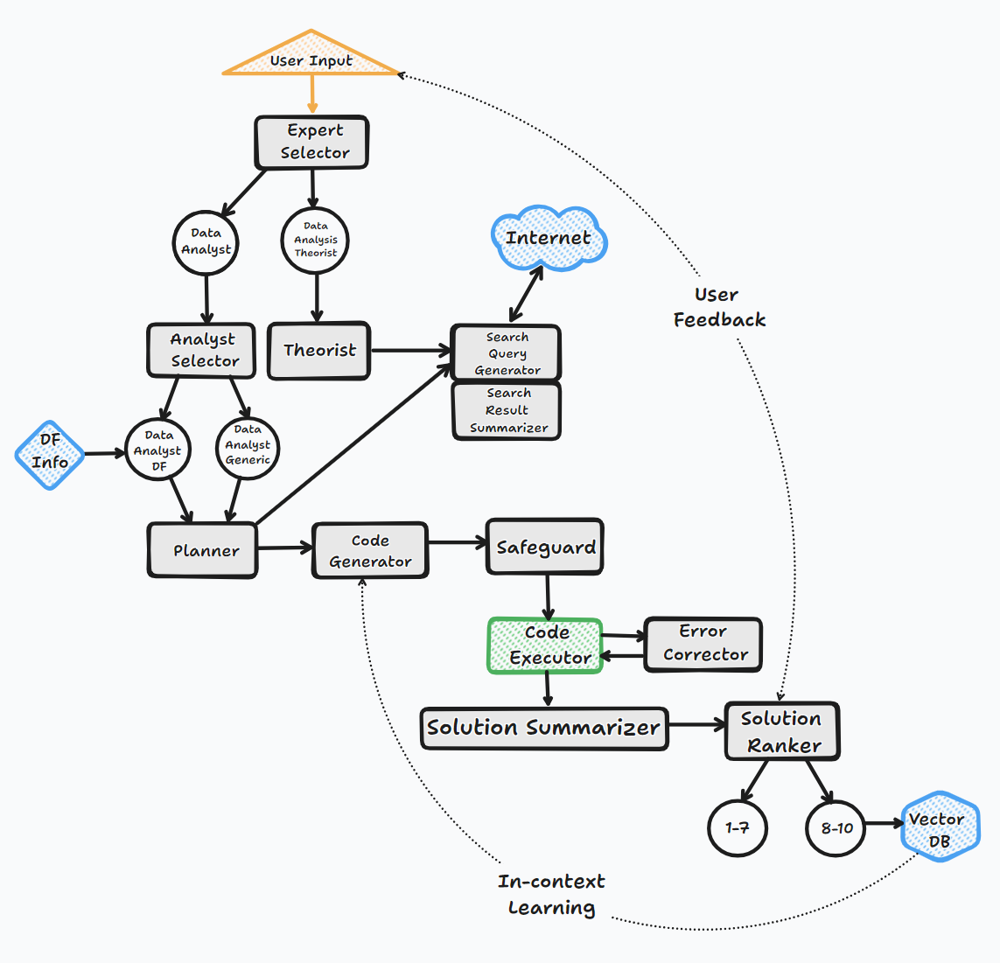

# BambooAI


BambooAI is an open-source library that enables natural language-based data analysis using Large Language Models (LLMs). It works with both local datasets and can fetch data from external sources and APIs.

## Table of Contents
- [Overview](#overview)
- [Features](#features)
- [Demo Videos](#demo-videos)
- [Installation](#installation)
- [Quick Start](#quick-start)
- [How It Works](#how-it-works)
- [Configuration](#configuration)
  - [Parameters](#parameters)
  - [LLM Configuration](#llm-configuration)
- [Usage Examples](#usage-examples)
- [Web Application Setup](#web-application-setup)
  - [Using Docker (Recomended)](option-1-using-docker-recomended)
  - [Using pip package](#option-2-using-pip-package)
  - [Using complete repository](#option-3-using-complete-repository) 
- [Model Support](#model-support)
- [Environment Variables](#environment-variables)
- [Logging](#logging)
- [Performance Comparison](#performance-comparison)
- [Contributing](#contributing)

## Overview

BambooAI is an experimental tool that makes data analysis more accessible by allowing users to interact with their data through natural language conversations. It's designed to:

- Process natural language queries about datasets
- Generate and execute Python code for analysis and visualization
- Help users derive insights without extensive coding knowledge
- Augment capabilities of data analysts at all levels
- Streamline data analysis workflows

## Features

- Natural language interface for data analysis
- Web UI and Jupyter notebook support
- Support for local and external datasets
- Integration with internet searches and external APIs
- User feedback during stream
- Optional planning agent for complex tasks
- Integration of custom ontologies
- Code generation for data analysis and visualization
- Self healing/error correction
- Custom code edits and code execution
- Knowledge base integration via vector database
- Workflows saving and follow ups
- In-context and multimodal queries

## Demo Videos

### Machine Learning Example (Jupyter Notebook)
A demonstration of creating a machine learning model to predict Titanic passenger survival:

https://github.com/user-attachments/assets/59ef810c-80d8-4ef1-8edf-82ba64178b85

### Sports Data Analysis (Web UI)
Example of various sports data analysis queries:

https://github.com/user-attachments/assets/21185939-31d2-46c9-b81a-21066ca99d10

## Installation

```bash
pip install bambooai
```

Or alternatively clone the repo and install the requirements

```bash
git clone https://github.com/pgalko/BambooAI.git
pip install -r requirements.txt
```

## Quick Start

Try it out on a basic example in Google Colab: [](https://colab.research.google.com/drive/1grKtqKD4u8cVGMoVv__umci4F7IU14vU?usp=sharing)

### Basic Example

1. Install BambooAI:
   ```bash
   pip install bambooai
   ```

3. Configure environment:
   ```bash
   cp .env.example .env
   # Edit .env with your settings
   ```

4. Configure agents/models
   ```bash
   cp LLM_CONFIG_sample.json LLM_CONFIG.json
   # Edit LLM_CONFIG.json with your desired combination of agents, models and parameters
   ```

5. Run
    ```python
    import pandas as pd
    from bambooai import BambooAI

    import plotly.io as pio
    pio.renderers.default = 'jupyterlab'

    df = pd.read_csv('titanic.csv')
    bamboo = BambooAI(df=df, planning=True, vector_db=False, search_tool=True)
    bamboo.pd_agent_converse()
    ```

## How It Works

The BambooAI operates through six key steps:

1. **Initiation**
   - Launches with a user question or prompt for one
   - Continues in a conversation loop until exit

2. **Task Routing**
   - Classifies questions using LLM
   - Routes to appropriate handler (text response or code generation)

3. **User Feedback**
   - If the instruction is vague or unclear the model will pause and ask user for feedback
   - If the model encounters any ambiguity during the solving process, it will pause and ask for direction offering a few options

4. **Dynamic Prompt Build**
   - Evaluates data requirements
   - Asks for feedback or uses tools if more context is needed
   - Formulates analysis plan
   - Performs semantic search for similar questions
   - Generates code using selected LLM

5. **Debugging and Execution**
   - Executes generated code
   - Handles errors with LLM-based correction
   - Retries until successful or limit reached

6. **Results and Knowledge Base**
   - Ranks answers for quality
   - Stores high-quality solutions in vector database
   - Presents formatted results or visualizations

### Flow Chart


## Configuration

### Parameters

BambooAI accepts the following initialization parameters:

```python
bamboo = BambooAI(
    df=None,                    # DataFrame to analyze
    auxiliary_datasets=None,    # List of paths to auxiliary datasets
    max_conversations=4,        # Number of conversation pairs to keep in memory
    search_tool=False,          # Enable internet search capability
    planning=False,             # Enable planning agent for complex tasks
    webui=False,                # Run as web application
    vector_db=False,            # Enable vector database for knowledge storage
    df_ontology=False,          # Use custom dataframe ontology
    exploratory=True,           # Enable expert selection for query handling
    custom_prompt_file=None     # Enable the use of custom/modified prompt templates
)
```

#### Detailed Parameter Descriptions:

- `df` (pd.DataFrame, optional)
  - Input dataframe for analysis
  - If not provided, BambooAI will attempt to source data from the internet or auxiliary datasets

- `auxiliary_datasets` (list, default=None)
  - List of paths to auxiliary datasets
  - These will be incorporated into the solution as needed, and pulled when the code executes
  - These are to complement the main dataframe

- `max_conversations` (int, default=4)
  - Number of user-assistant conversation pairs to maintain in context
  - Affects context window and token usage

- `search_tool` (bool, default=False)
  - Enables internet search capabilities
  - Requires appropriate API keys when enabled

- `planning` (bool, default=False)
  - Enables the Planning agent for complex tasks
  - Breaks down tasks into manageable steps
  - Improves solution quality for complex queries

- `webui` (bool, default=False)
  - Runs BambooAI as a web application
  - Uses Flask API for web interface

- `vector_db` (bool, default=False)
  - Enables vector database for knowledge storage and semantic search
  - Stores high-quality solutions for future reference
  - Requires Pinecone API key
  - Supports two embeddings models `text-embedding-3-small`(OpenAI) and `all-MiniLM-L6-v2`(HF)

- `df_ontology` (str, default=None)
  - Uses custom dataframe ontology for improved understanding
  - Requires OWL ontology as a `.ttl` file. The parameter takes the path to the TTL file.
  - Significantly improves solution quality

- `exploratory` (bool, default=True)
  - Enables expert selection for query handling
  - Chooses between Research Specialist and Data Analyst roles

- `custom_prompt_file` (str, default=None)
  - Enables users to provide custom prompt templates
  - Requires path to the YAML file containing the templates

### LLM Configuration

BambooAI uses multi-agent system where different specialized agents handle specific aspects of the data analysis process. Each agent can be configured to use different LLM models and parameters based on their specific requirements.

#### Configuration Structure

The LLM configuration is stored in `LLM_CONFIG.json`. Here's the complete configuration structure:

```json
{
  "agent_configs": [
    {"agent": "Expert Selector", "details": {"model": "gpt-4.1", "provider":"openai","max_tokens": 2000, "temperature": 0}},
    {"agent": "Analyst Selector", "details": {"model": "claude-3-7-sonnet-20250219", "provider":"anthropic","max_tokens": 2000, "temperature": 0}},
    {"agent": "Theorist", "details": {"model": "gemini-2.5-pro-preview-03-25", "provider":"gemini","max_tokens": 4000, "temperature": 0}},
    {"agent": "Dataframe Inspector", "details": {"model": "gemini-2.0-flash", "provider":"gemini","max_tokens": 8000, "temperature": 0}},
    {"agent": "Planner", "details": {"model": "gemini-2.5-pro-preview-03-25", "provider":"gemini","max_tokens": 8000, "temperature": 0}},
    {"agent": "Code Generator", "details": {"model": "claude-3-5-sonnet-20241022", "provider":"anthropic","max_tokens": 8000, "temperature": 0}},
    {"agent": "Error Corrector", "details": {"model": "claude-3-5-sonnet-20241022", "provider":"anthropic","max_tokens": 8000, "temperature": 0}},
    {"agent": "Reviewer", "details": {"model": "gemini-2.5-pro-preview-03-25", "provider":"gemini","max_tokens": 8000, "temperature": 0}},
    {"agent": "Solution Summarizer", "details": {"model": "gemini-2.5-flash-preview-04-17", "provider":"gemini","max_tokens": 4000, "temperature": 0}},
    {"agent": "Google Search Executor", "details": {"model": "gemini-2.5-flash-preview-04-17", "provider":"gemini","max_tokens": 4000, "temperature": 0}},
    {"agent": "Google Search Summarizer", "details": {"model": "gemini-2.5-flash-preview-04-17", "provider":"gemini","max_tokens": 4000, "temperature": 0}}
  ],
  "model_properties": {
    "gpt-4o": {"capability":"base","multimodal":"true", "templ_formating":"text", "prompt_tokens": 0.0025, "completion_tokens": 0.010},
    "gpt-4.1": {"capability":"base","multimodal":"true", "templ_formating":"text", "prompt_tokens": 0.002, "completion_tokens": 0.008},
    "gpt-4o-mini": {"capability":"base", "multimodal":"true","templ_formating":"text", "prompt_tokens": 0.00015, "completion_tokens": 0.0006},
    "gpt-4.1-mini": {"capability":"base", "multimodal":"true","templ_formating":"text", "prompt_tokens": 0.0004, "completion_tokens": 0.0016},
    "o1-mini": {"capability":"reasoning", "multimodal":"false","templ_formating":"text", "prompt_tokens": 0.003, "completion_tokens": 0.012},
    "o3-mini": {"capability":"reasoning", "multimodal":"false","templ_formating":"text", "prompt_tokens": 0.0011, "completion_tokens": 0.0044},
    "o1": {"capability":"reasoning", "multimodal":"false","templ_formating":"text", "prompt_tokens": 0.015, "completion_tokens": 0.06},
    "gemini-2.0-flash": {"capability":"base", "multimodal":"true","templ_formating":"text", "prompt_tokens": 0.0001, "completion_tokens": 0.0004},
    "gemini-2.5-flash-preview-04-17": {"capability":"reasoning", "multimodal":"true","templ_formating":"text", "prompt_tokens": 0.00015, "completion_tokens": 0.0035},
    "gemini-2.0-flash-thinking-exp-01-21": {"capability":"reasoning", "multimodal":"false","templ_formating":"text", "prompt_tokens": 0.0, "completion_tokens": 0.0},
    "gemini-2.5-pro-exp-03-25": {"capability":"reasoning", "multimodal":"true","templ_formating":"text", "prompt_tokens": 0.0, "completion_tokens": 0.0},
    "gemini-2.5-pro-preview-03-25": {"capability":"reasoning", "multimodal":"true","templ_formating":"text", "prompt_tokens": 0.00125, "completion_tokens": 0.01},
    "claude-3-5-haiku-20241022": {"capability":"base", "multimodal":"true","templ_formating":"xml", "prompt_tokens": 0.0008, "completion_tokens": 0.004},
    "claude-3-5-sonnet-20241022": {"capability":"base", "multimodal":"true","templ_formating":"xml", "prompt_tokens": 0.003, "completion_tokens": 0.015},
    "claude-3-7-sonnet-20250219": {"capability":"base", "multimodal":"true","templ_formating":"xml", "prompt_tokens": 0.003, "completion_tokens": 0.015},
    "open-mixtral-8x7b": {"capability":"base", "multimodal":"false","templ_formating":"text", "prompt_tokens": 0.0007, "completion_tokens": 0.0007},
    "mistral-small-latest": {"capability":"base", "multimodal":"false","templ_formating":"text", "prompt_tokens": 0.001, "completion_tokens": 0.003},
    "codestral-latest": {"capability":"base", "multimodal":"false","templ_formating":"text", "prompt_tokens": 0.001, "completion_tokens": 0.003},
    "open-mixtral-8x22b": {"capability":"base", "multimodal":"false","templ_formating":"text", "prompt_tokens": 0.002, "completion_tokens": 0.006},
    "mistral-large-2407": {"capability":"base", "multimodal":"false","templ_formating":"text", "prompt_tokens": 0.003, "completion_tokens": 0.009},
    "deepseek-chat": {"capability":"base", "multimodal":"false","templ_formating":"text", "prompt_tokens": 0.00014, "completion_tokens": 0.00028},
    "deepseek-reasoner": {"capability":"reasoning", "multimodal":"false","templ_formating":"text", "prompt_tokens": 0.00055, "completion_tokens": 0.00219},
    "/mnt/c/Users/pgalk/vllm/models/DeepSeek-R1-Distill-Qwen-14B": {"capability":"reasoning", "multimodal":"false","templ_formating":"text", "prompt_tokens": 0.00, "completion_tokens": 0.00},
    "deepseek-r1-distill-llama-70b": {"capability":"reasoning", "multimodal":"false","templ_formating":"text", "prompt_tokens": 0.00, "completion_tokens": 0.00},
    "deepseek-r1:32b": {"capability":"reasoning", "multimodal":"false","templ_formating":"text", "prompt_tokens": 0.00, "completion_tokens": 0.00},
    "deepseek-ai/deepseek-r1": {"capability":"reasoning", "multimodal":"false","templ_formating":"text", "prompt_tokens": 0.00, "completion_tokens": 0.00}
  }
}
```
The `LLM_CONFIG.json` configuration file needs to be located in the BambooAI working dir, eg. `/Users/palogalko/AI_Experiments/Bamboo_AI/web_app/LLM_CONFIG.json`, and all API keys for the specified models need to be present in the `.env` also located in the working dir.
The above combination of agents/models is the most performant according to our tests as of 22 Apr 2025 using sports and performance datasets. I would strongly encourage you to experiment with these settings to see what combination best suits your particular use case.

#### Agent Roles

- **Expert Selector**: Determines the best expert type for handling the query
- **Analyst Selector**: Selects specific analysis approach
- **Theorist**: Provides theoretical background and methodology
- **Dataframe Inspector**: Analyzes and understands data structure. (Requires ontology file)
- **Planner**: Creates step-by-step analysis plans
- **Code Generator**: Writes Python code for analysis
- **Error Corrector**: Debugs and fixes code issues
- **Reviewer**: Evaluates solution quality, and adjusts the plans accordingly
- **Solution Summarizer**: Creates concise result summaries
- **Google Search Executor**: Optimizes and executes search queries
- **Google Search Summarizer**: Synthesizes search results

#### Configuration Fields

- `agent_configs`: Agents configuration
  - `agent`: The type of agent
  - `details`:
    - `model`: Model identifier
    - `provider`: Service provider (openai, anthropic, gemini, etc.)
    - `max_tokens`: Maximum tokens for completion
    - `temperature`: Creativity parameter (0-1)

- `model_properties`: Model properties
  - `capability`: Base or Reasoning model
  - `multimodal`: Multimodal or text only
  - `templ_formating`: Prompt formatting. XML or Text
  - `prompt_tokens`: Cost of input (1K)
  - `completion_tokens`: Cost of output (1K)

If you assign a model for an agent in `agent_configs` make sure that the model is defined in `model_properties`.

#### Example Alternative Configurations

1. **Using Ollama:**
```json
{
  "agent": "Planner",
  "details": {
    "model": "llama3:70b",
    "provider": "ollama",
    "max_tokens": 2000,
    "temperature": 0
  }
}
```

2. **Using VLLM:**
```json
{
  "agent": "Code Generator",
  "details": {
    "model": "/path/to/model/DeepSeek-R1-Distill-14B",
    "provider": "vllm",
    "max_tokens": 2000,
    "temperature": 0
  }
}
```

## Auxiliary Datasets

BambooAI supports working with multiple datasets simultaneously, allowing for more comprehensive and contextual analysis. 
The auxiliary datasets feature enables you to reference and incorporate additional data sources alongside your primary dataset.

When you ask questions that might benefit from auxiliary data, BambooAI will:

1. Analyze which datasets contain relevant information
2. Load only the necessary datasets
3. Join or cross-reference the data as needed
4. Generate and execute code that properly handles the multi-dataset operations

### How to Use

```python
from bambooai import BambooAI
import pandas as pd

# Load primary dataset
main_df = pd.read_csv('main_data.csv')

# Specify paths to auxiliary datasets
auxiliary_paths = [
    'path/to/supporting_data1.csv',
    'path/to/supporting_data2.parquet',
    'path/to/reference_data.csv'
]

# Initialize BambooAI with auxiliary datasets
bamboo = BambooAI(
    df=main_df,
    auxiliary_datasets=auxiliary_paths,
)
```

## Dataframe Ontology

BambooAI supports custom dataframe ontologies to improve analysis accuracy.

[Ontology Integration Wiki](https://github.com/pgalko/BambooAI/wiki/Dataframe-Ontology-Integration)

[Medium Blog Post](https://medium.com/@palogalko/knowledge-graph-driven-data-analysis-making-ai-speak-your-domains-language-b2200fd60413)

### How to Use

```python
from bambooai import BambooAI
import pandas as pd

# Initialize with ontology file path
bamboo = BambooAI(
    df=your_dataframe,
    df_ontology="path/to/ontology.ttl"
)
```

### What It Does

The ontology file defines your data structure using RDF/OWL notation, including:
- Object properties (relationships)
- Data properties (attributes)
- Classes (data types)
- Individuals (specific instances)

This helps BambooAI understand complex data relationships and generate more accurate code.


## Usage Examples

### Interactive Mode (Jupyter Notebook or CLI)
```python
import pandas as pd
from bambooai import BambooAI

import plotly.io as pio
pio.renderers.default = 'jupyterlab'

df = pd.read_csv('training_activity_data.csv')
aux_data = [
    'path/to/wellness_data.csv',
    'path/to/nutrition_data.parquet',
]

bamboo = BambooAI(df=df, search_tool=True, planning=True)
bamboo.pd_agent_converse()
```

### Single Query Mode (Jupyter Notebook or CLI)
```python
bamboo.pd_agent_converse("Calculate 30, 50, 75 and 90 percentiles of the heart rate column")
```

## Web Application Setup

Web UI screenshot (Interactive Workflow Map):


### Option 1: Using Docker (Recomended)

BambooAI can be easily deployed using Docker, which provides a consistent environment regardless of your operating system or local setup.

For detailed Docker setup and usage instructions, please refer to our [Docker Setup Wiki](https://github.com/pgalko/BambooAI/wiki/Docker-Installation-Guide-for-BambooAI).

The Docker approach offers several advantages:
- No need to manage Python dependencies locally
- Consistent environment across different machines
- Easy configuration through volume mounting
- Support for both repository-based and standalone deployments
- **Sandboxed code execution** for enhanced security

Prerequisites:
- [Docker](https://docs.docker.com/get-docker/) installed on your system
- [Docker Compose](https://docs.docker.com/compose/install/) installed on your system

### Option 2: Using pip package

1. Install BambooAI:
   ```bash
   pip install bambooai
   ```

2. Download web_app folder from repository

3. Configure environment:
   ```bash
   cp .env.example <path_to_web_app>/.env
   # Edit .env with your settings
   ```

4. Configure LLM agents, models and parameters
   ```bash
   cp LLM_CONFIG_sample.json <path_to_web_app>/LLM_CONFIG.json
   ```

   - Edit `web_app/LLM_CONFIG.json` in the web_app directory
   - Configure each agent with desired model:
   ```json
   {
      "agent_configs": [
        {
          "agent": "Code Generator",
          "details": {
            "model": "your-preferred-model",
            "provider": "provider-name",
            "max_tokens": 4000,
            "temperature": 0
          }
        }
      ]
   }
   ```
   - If no configuration is provided the execution will fail and an error message will be displayed.

5. Run application:
   ```bash
   cd <path_to_web_app>
   python app.py
   ```

### Option 3: Using complete repository

1. Clone repository:
   ```bash
   git clone https://github.com/pgalko/BambooAI.git
   cd BambooAI
   ```

2. Install dependencies:
   ```bash
   pip install -r requirements.txt
   ```

3. Configure environment:
   ```bash
   cp .env.example web_app/.env
   # Edit .env with your settings
   ```

4. Configure LLM agents, models and parameters
   ```bash
   cp LLM_CONFIG_sample.json web_app/LLM_CONFIG.json
   ```

   - Edit `web_app/LLM_CONFIG.json` in the web_app directory
   - Configure each agent with desired model:
   ```json
   {
      "agent_configs": [
        {
          "agent": "Code Generator",
          "details": {
            "model": "your-preferred-model",
            "provider": "provider-name",
            "max_tokens": 4000,
            "temperature": 0
          }
        }
      ]
   }
   ```
   - If no configuration is provided the execution will fail and an error message will be displayed.
5. Run application:
   ```bash
   cd web_app
   python app.py
   ```

Access web interface at http://localhost:5000

## Model Support

### API-based Models
- OpenAI
- Google (Gemini)
- Anthropic
- Groq
- Mistral
- DeepSeek
- OpenRouter

### Local Models
- Ollama (all models)
- VLLM (all models)
- Various local models

## Environment Variables

Required variables in `.env`:

#### Model API Keys. Specify the API keys for the models you want to use, and have access to.
- `<VENDOR_NAME>_API_KEY`: API keys for selected providers
- `GEMINI_API_KEY`: This needs to be set if you want to use the native Gemini web search tool (Grounding). You can alternatively use Selenium, however it is much slower and not as tightly integrated.

#### Search and VectorDB API Keys(Optional)
- `PINECONE_API_KEY`: Optional for vector database
- `SERPER_API_KEY`: Required for Selenium search

#### Remote API Endpoints(Optional)
- `REMOTE_OLLAMA`: Optional URL for remote Ollama server
- `REMOTE_VLLM`: Optional URL for remote VLLM server

#### Application Configuration
- `FLASK_SECRET`: This is used to sign the session cookie for WebApp
- `WEB_SEARCH_MODE`: 'google_ai' to use Gemini native search tool, or 'selenium' to use selenium web driver
- `SELENIUM_WEBDRIVER_PATH`: Path to your Selenium WebDriver. This is required if you are using the 'selenium' web search mode.
- `EXECUTION_MODE`: 'local' to run the code executor locally, or 'api' to run the code executor on a remote server or container.
- `EXECUTOR_API_BASE_URL`: `URL of the remote code executor API. This is required if you are using the 'api' execution mode eg.http://192.168.1.201:5000

## Logging

The log for each Run/Thread is stored in `logs/bambooai_run_log.json`. The file gets overwriten when the new Thread starts.
Consolidated logs are stored in `logs/bambooai_consolidated_log.json` with 5MB size limit and 3-file rotation. Logged information includes:

- Chain ID
- LLM call details (agent, timestamp, model, prompt, response)
- Token usage and costs
- Performance metrics
- Summary statistics per model

## Performance Comparison


For detailed evaluation report, see: [Objective Assessment Report](https://github.com/user-attachments/files/20273296/Objective.Assessment.of.AI.Tools.for.Sports.Data.Analytics_.BambooAI.vs.Generic.LLMs.pdf)


## Contributing
Contributions are welcome via pull requests. Focus on maintaining code readability and conciseness.

This project is indexed with DeepWiki by Cognition Labs, providing developers with:
- AI-generated comprehensive documentation
- Interactive code exploration
- Context-aware development guidance
- Visualization of project workflows

Access the project's full interactive documentation:
[DeepWiki pgalko/BambooAI](https://deepwiki.com/pgalko/BambooAI)

## Notes

- Supports multiple model providers and local execution
- Exercise caution with code execution
- Monitor token usage
- Development is ongoing

## Todo

- Future improvements planned
