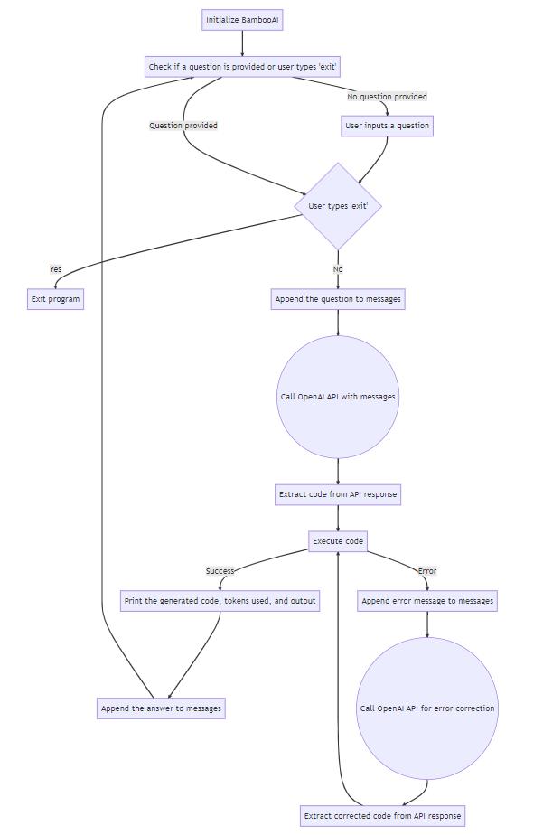
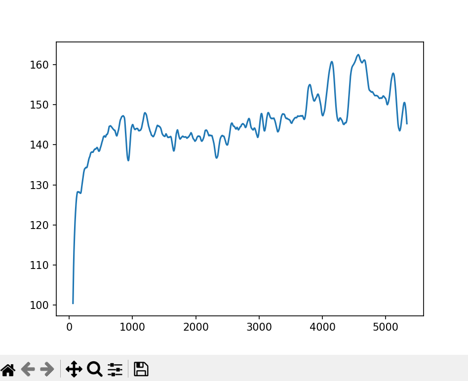
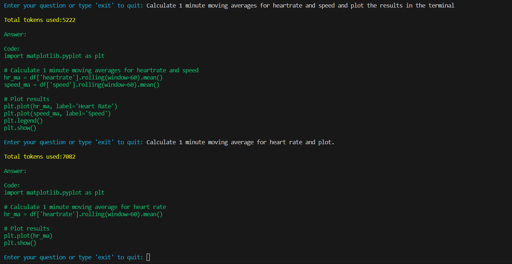

# BambooAI
A lightweight library that leverages Language Models (LLMs) to enable natural language interactions, allowing you to converse with your pandas DataFrames.

## Objective

The BambooAI library is a user-friendly tool designed to make data analysis more accessible to non-programmers. Utilizing the power of Large Language Models (LLM), BambooAI can comprehend your questions about a dataset and automatically generate and execute the appropriate Python code for both analysis and plotting. Users can effortlessly gain valuable insights from their data without writing complex code or mastering advanced programming techniques. With BambooAI, simply input your dataset, ask questions in plain English, and receive answers along with relevant out of the box visualizations if asked for to help you better understand your data.

My aim was to keep the code base under 200 lines to ensure easy comprehension and clarity for users of various skill levels. By maintaining a concise code base, I strived to create an accessible and straightforward tool that streamlines the process of data analysis and visualization. This approach not only makes it easier for developers and users to understand the library's inner workings but also fosters efficient implementation and customization, catering to a diverse audience and their unique needs.

## How it works

- User starts BambooAI
- BambooAI checks if a question is provided
  - If a question is given programmatically, it gets processed and the assistant exits after the execution
  - If no question is provided programaticaly, BambooAI prompts the user for one and enters a loop of questions and answers, remembering the conversation history
    - Sends each question to the OpenAI API LLM along with the conversation history
    - Obtains a response with corresponding Python code
    - Executes the code to generate an answer or visualization
      - If the code works, it displays the answer or visualization, and then prompts for another question, which could be related to the preceding question or an entirely new topic
      - If an error occurs, the program requests a corrected code from the OpenAI API by providing the error message and then attempts to execute the corrected code.
  - The loop continues until the user enters 'exit', at which point the program terminates
  - The program displays the total token usage at each step, providing insight into the resources consumed during the process.
  
**Flow chart:**



## How to use

**Installation**

```
pip install bambooai
```

**Usage**

Run in a loop
```
# Run in a loop remembering the conversation history
import pandas as pd
from bambooai import BambooAI

df = pd.read_csv('test_activity_data.csv')
bamboo = BambooAI(df)
bamboo.pd_agent_converse()
```
Single execution
```
# Run programaticaly (Single execution).
import pandas as pd
from bambooai import BambooAI

df = pd.read_csv('test_activity_data.csv')
bamboo = BambooAI(df)
bamboo.pd_agent_converse("Calculate 30, 50, 75 and 90 percentiles of the heart rate column")
```
Visualize the data (Uses Matplotlib). Works with both Loop and Single execution

```
# Visualize the data from the dataframe.
import pandas as pd
from bambooai import BambooAI

df = pd.read_csv('test_activity_data.csv')
bamboo = BambooAI(df)
bamboo.pd_agent_converse("Calculate 1 minute moving average for the heartrate and plot together with a polynomial line of best fit")
```

## Examples

**Console Output 1:**


**Console Output 2:**


**Plot 1:**



**Plot 2:**


**Plot Code:**



## Notes

