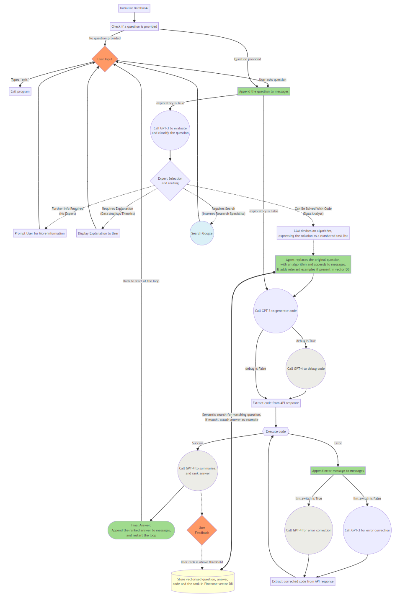
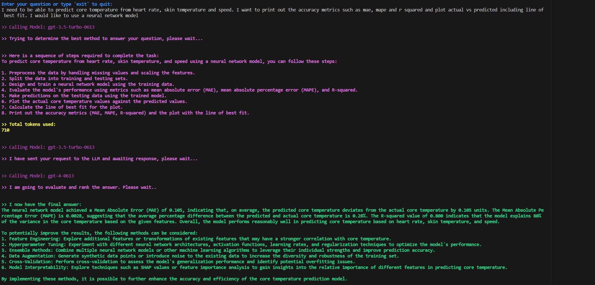
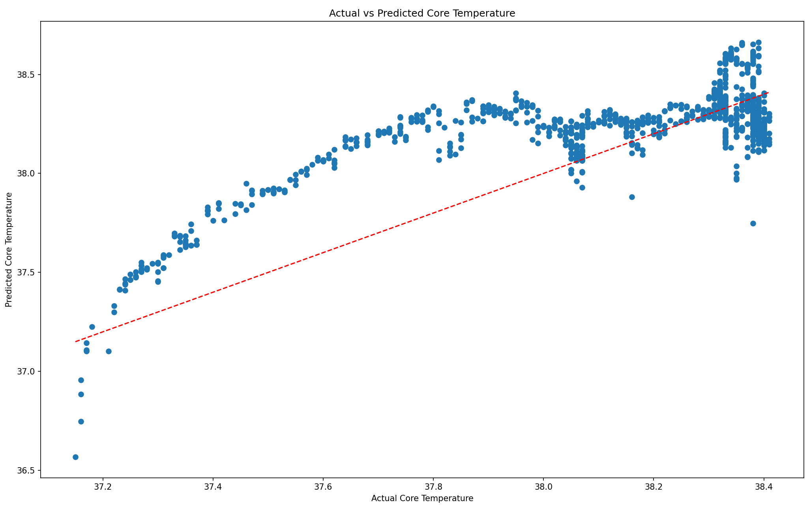
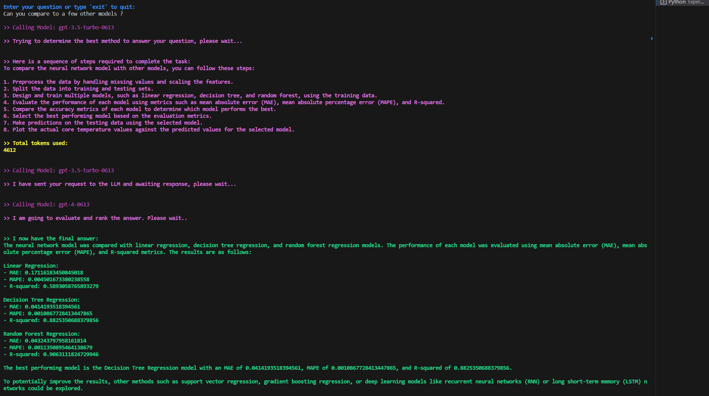
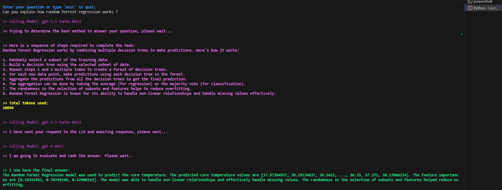
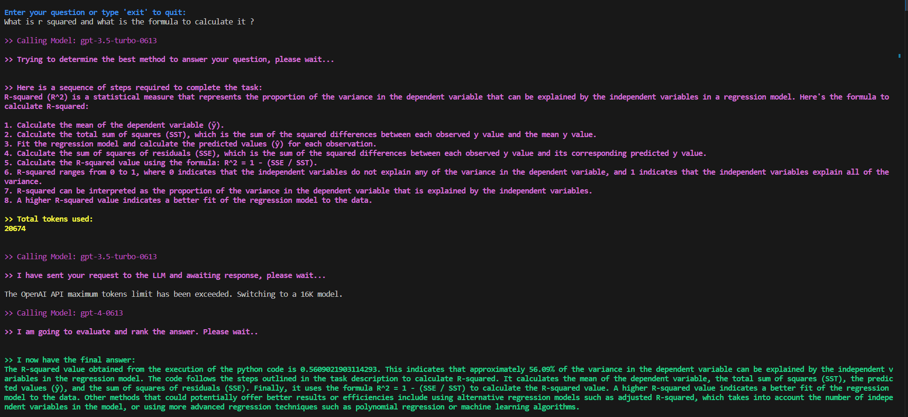
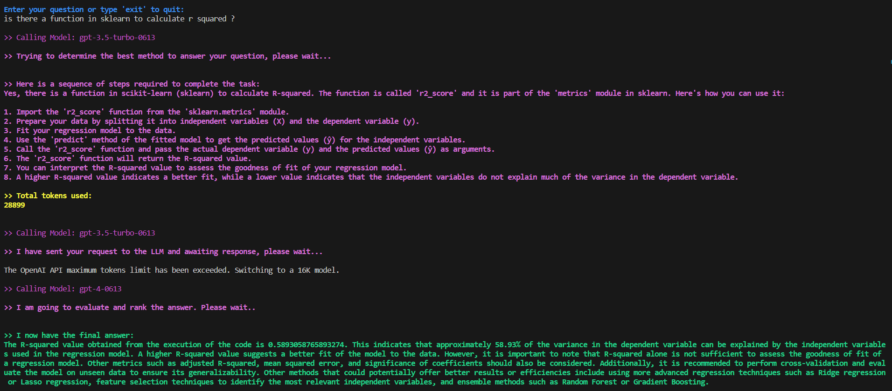
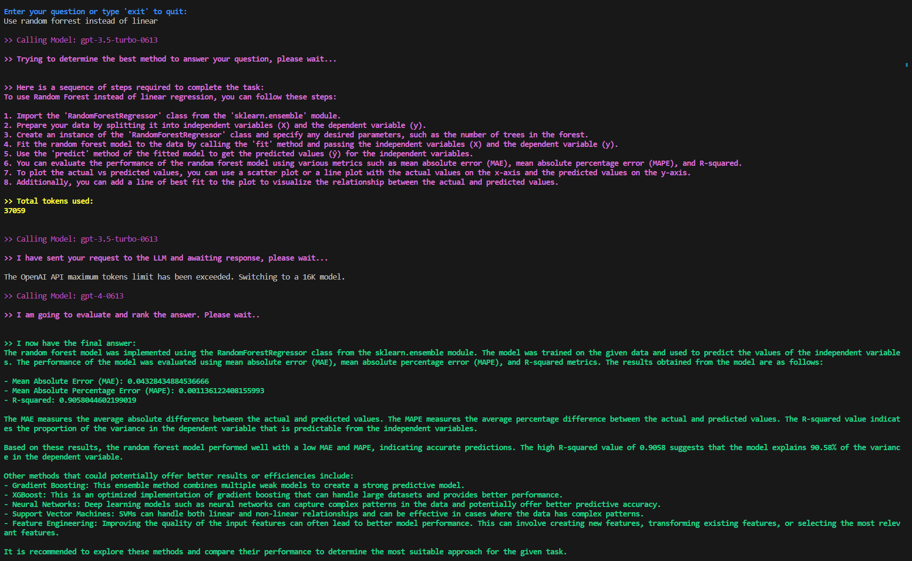
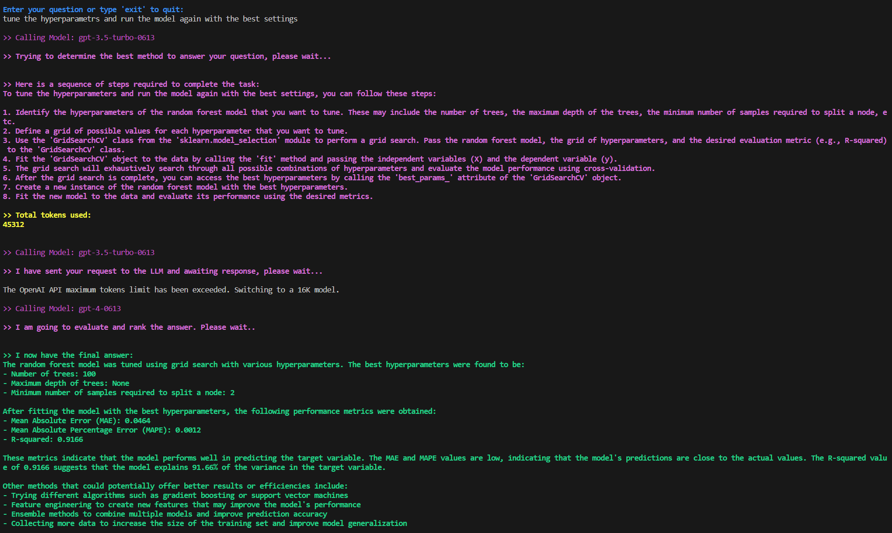

# BambooAI
A lightweight library utilizing Large Language Models (LLMs) to provide natural language interaction capabilities, much like a research and data analysis assistant enabling conversation with your data. You can either provide your own data sets, or allow the library to locate and fetch data for you. It supports Internet searches and external API interactions.

## Objective

The BambooAI library is an experimental, lightweight tool that leverages Large Language Models (LLMs) to make data analysis more intuitive and accessible, even for non-programmers. Functioning like a research and data analysis assistant, it enables users to engage in natural language interactions with their data. You can supply your own data sets, or let BambooAI find and retrieve the necessary data for you. It also integrates Internet searches and an access to external APIs for broader context and utility.

By understanding your natural language inquiries about a dataset, BambooAI can autonomously generate and execute the relevant Python code for analysis and visualization. This allows users to effortlessly extract valuable insights from their data without needing to write complex code or master advanced programming concepts. Just input your dataset, pose your questions in plain English, and BambooAI provides answers along with ready-to-use visualizations if requested, to deepen your understanding of the data.

The primary aim of BambooAI is to enhance, not replace, the capabilities of analysts at every level. This library simplifies the processes of data analysis and visualization, thereby streamlining workflows. It's designed to be relatively user-friendly, efficient, and adaptable to different users' needs. As a supportive tool rather than the central operator, BambooAI empowers users to apply their analytical skills more effectively and boost their productivity.

## Preview

**Try it out in Google Colab:**

[](https://colab.research.google.com/drive/1grKtqKD4u8cVGMoVv__umci4F7IU14vU?usp=sharing)

**A Generic Example (No dataframe required, Data downloaded from Internet):**
```
df = pd.read_csv('test_activity_data.csv')
bamboo = BambooAI(df, debug=False, llm="gpt-4", llm_switch=False, vector_db=True, search_tool=True)
bamboo.pd_agent_converse()
```

https://github.com/pgalko/BambooAI/assets/39939157/ea72de1c-05db-472e-9c95-fa8e27fb1f7a


**A Machine Learning Example using supplied dataframe:**
```
df = pd.read_csv('test_activity_data.csv')
bamboo = BambooAI(df, debug=True, llm_switch=True, vector_db=True, search_tool=True)
bamboo.pd_agent_converse()
```

https://github.com/pgalko/BambooAI/assets/39939157/158f3e31-236f-42aa-8c08-b194a5483c27

## How it works

The BambooAI agent operates through several key steps to interact with users and generate responses:

**1. Initiation**
- The user launches the BambooAI agent with a question.
- If no initial question is provided, the agent prompts the user for a question or an 'exit' command to terminate the program.
- The agent then enters a loop where it responds to each question provided, and upon completion, prompts the user for the next question. This loop continues until the user chooses to exit the program.

**2. Task Evaluation**
- The agent stores the received question and utilizes the Large Language Model (LLM) to evaluate and categorize it.
- The LLM determines whether the question necessitates a textual response, additional information (Google search), or can be resolved using code.
- Depending on the task evaluation and classification the agent calls the appropriate agent.

**3. Dynamic Prompt Build**
- If the question can be resolved by code, the agent determines whether the necessary data is contained within the provided dataset, requires downloading from an external source, or if the question is of a generic nature and data is not required.
- The agent then chooses its approach accordingly. It formulates an algorithm, expressed as a task list, to serve as a blueprint for the analysis.
- The original question is modified to align with this algorithm. The agent performs a semantic search against a vector database for similar questions.
- Any matching questions found are appended to the prompt as examples. GPT-3.5 or GPT-4 is then used to generate code based on the algorithm.

**4. Debugging, Execution, and Error Correction**
- If the generated code needs debugging, GPT-4 is engaged.
- The code is executed, and if errors occur, the agent logs the error message and refers it to the LLM (GPT-3 or GPT-4, depending on the settings) for correction.
- This process continues until successful code execution.

**5. Results, Ranking, and Knowledge Base Build**
- Post successful execution, GPT-4 is used to rank the answer.
- If the rank surpasses a set threshold, the question, answer, code, and rank are stored in the Pinecone vector database.
- Regardless of the rank, the final answer or visualization is formatted and presented to the user.

**6. Human Feedback and Loop Continuation**
- The agent seeks feedback from the user.
- If the user validates the auto-generated ranking, the question/answer pair is stored in the vector database.
- If not, a new execution loop begins.

Throughout this process, the agent continuously solicits user input, stores messages for context, and generates and executes code to ensure optimal results. Various AI models and a vector database are employed in this process to provide accurate and helpful responses to user's questions.

 
**Flow chart:**



## How to use

**Installation**

```
pip install bambooai
```

**Usage**

Parameters

```
df: pd.DataFrame - Dataframe (It will try to source the data from internet, if 'df' is not provided)

max_conversations: int - Number of "user:assistant" conversation pairs to keep in memory for a context. Default=2

llm: str - Base LLM model. Default = gpt-3.5-turbo-0613

llm_switch: bool - If True, the agent will switch to gpt-4 after error,or if a self reflection is required (code debug, solution ranking).

debug: bool - If True, the received code is sent back to the Language Learning Model (LLM) for an evaluation of its relevance to the user's question, along with code error checking and debugging.

search_tool: bool - If True, the agent will switch to a google search if the answer is not available or satisfactory.

vector_db: bool - If True, each answer will first be ranked from 1 to 10. If the rank surpasses a certain threshold (8), the corresponding question (vectorised), answer, code, and rank (metadata) are all stored in the Pinecone database. Each time a new question is asked, these records will be searched. If the similarity score is above 0.9, they will be offered as examples and included in the prompt (in a one-shot learning scenario)

exploratory: bool - If set to True, the LLM will evaluate the user's question and select an "Expert" that is best suited to address the question (experts: Internet Search Specialist, Data Analisys Theoretician, Data Analyst). For instance, if the task involves code generation/execution, it will generate a task list detailing the steps, which will subsequently be sent to the LLM as a prompt for the next action. This method is particularly effective for vague user prompts, but it might not perform as efficiently with more specific prompts. The default setting is True.


e.g. bamboo = BambooAI(df, debug=True, vector_db=True, llm_switch=True, search_tool=True, exploratory=True)
```

Run in a loop

```
# Run in a loop remembering the conversation history
import pandas as pd
from bambooai import BambooAI

df = pd.read_csv('test_activity_data.csv')
bamboo = BambooAI(df)
bamboo.pd_agent_converse()
```
Single execution
```
# Run programaticaly (Single execution).
import pandas as pd
from bambooai import BambooAI

df = pd.read_csv('test_activity_data.csv')
bamboo = BambooAI(df)
bamboo.pd_agent_converse("Calculate 30, 50, 75 and 90 percentiles of the heart rate column")
```
Visualize the data (Uses Matplotlib). Works with both Loop and Single execution

**Environment Variables**

The library requires an OpenAI API account and the API key to connect to OpenAI LLMs. The OpenAI API key needs to be stored in a ```OPENAI_API_KEY``` environment variable.
The key can be obtained from here: https://platform.openai.com/account/api-keys.

The Pincone vector db is optional. If you don want to use it, you dont need to do anything. If you have an account with Pinecone and would like to use the knowledge base and ranking features, you will be required to setup ```PINECONE_API_KEY``` and ```PINECONE_ENV``` envirooment variables, and set the 'vector_db' parameter to True. The vector db index is created upon first execution.

The Google Search is also optional. If you don want to use it, you dont need to do anything. If you have an account with Serper and would like to use the Google Search feature, you will be required to setup ```SERPER_API_KEY``` environment variable, and set the 'search_tool' parameter to True.

## Examples

**CLI Output: Prediction of a core temperature using Machine Learning**

*Below is a machine learning example, BambooAI devising, implementing, comparing and finetuning a different Machine learning models to predict a Core Temperature.*



*A plot resulting from the first iteration using MLPRegressor model. No need to copy/paste the matplotlib code. Displays on the fly*



*Now compare to a few other ML models*



*Follow up question for clarification*



A further follow up, asking for clarification


More follow up... Notice the switch to a 16 model as it ran out of 4K window space



Yet more follow up question..



Got sidetracked, and needed a feedback for correction



Final iteration... using the best performing model and tuned hyper parameters. Final R-Squared 0.9166.



## Notes

- The library currently supports only OpenAI Chat models. It has been tested with both gpt-3.5-turbo and gpt-4. The gpt-3.5-turbo seems to perform well and is the preferred option due to its 10x lower cost.
- The library executes LLM generated Python code, this can be bad if the LLM generated Python code is harmful. Use cautiously.
- Be sure to monitor your token usage. At the time of writing, the cost per 1K tokens is $0.03 USD for GPT-4 and $0.002 USD for GPT-3.5-turbo. It's important to keep these costs in mind when using the library, particularly when using the more expensive models.
- Supported models: gpt-3.5-turbo, gpt-3.5-turbo-613, gpt-3.5-turbo-16k, gpt-4, gpt-4-0613.

## Contributing

Contributions are welcome; please feel free to open a pull request. Keep in mind that our goal is to maintain a concise codebase with high readability.

## ToDo

- Implement ReAct https://arxiv.org/abs/2201.11903, where a question can be decomposed into individual sub-steps and then sequentially routed to the appropriate Experts for processing. This approach should enhance the reasoning capabilities when dealing with multifaceted tasks.
- Add support for aditional LLMs.

