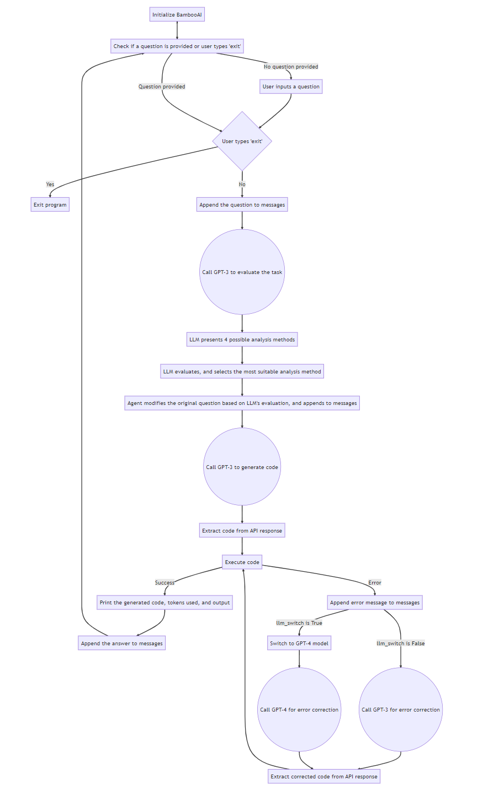
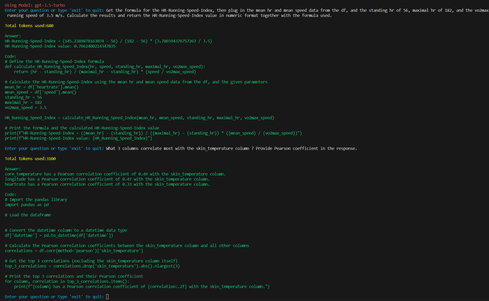
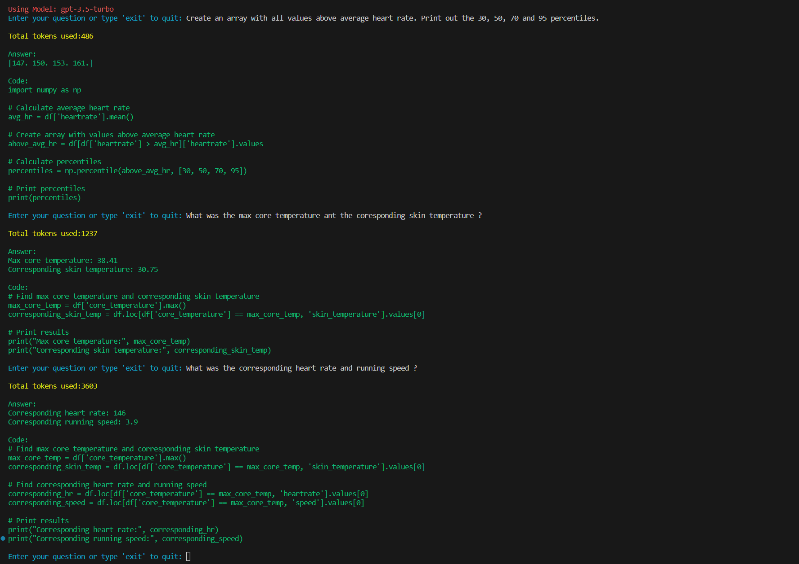
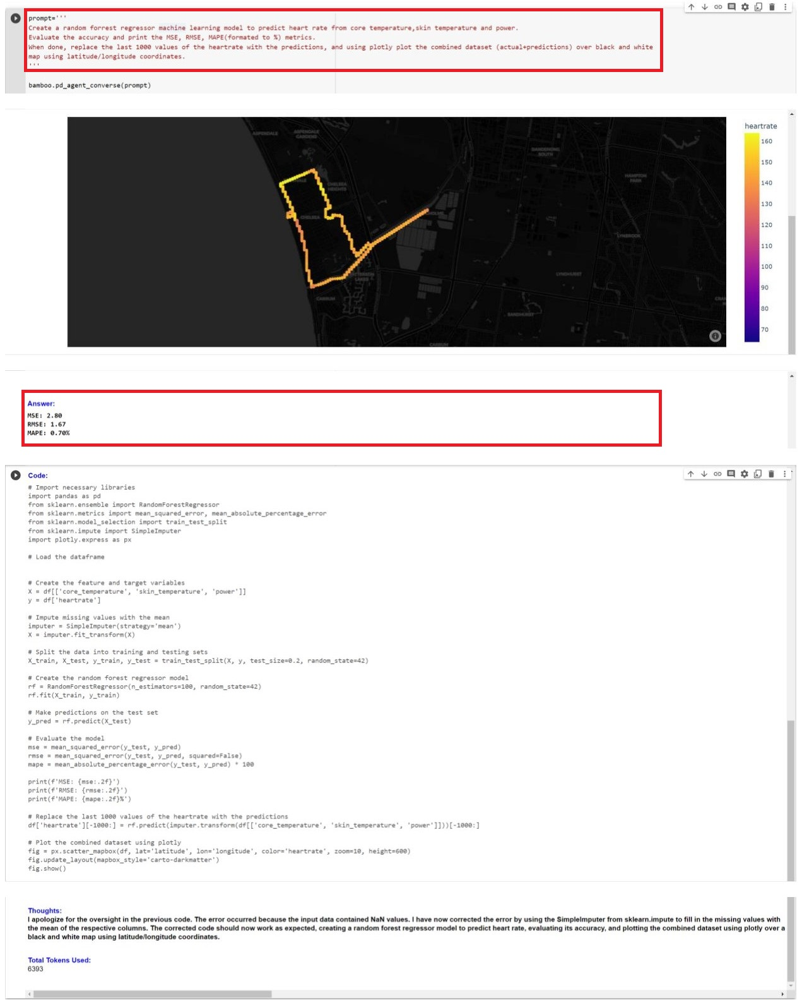

# BambooAI
A lightweight library that leverages Language Models (LLMs) to enable natural language interactions, allowing you to converse with your pandas DataFrames.

## Objective

The BambooAI library is a user-friendly tool designed to make data analysis more accessible to non-programmers. Utilizing the power of Large Language Models (LLM), BambooAI can comprehend your questions about a dataset and automatically generate and execute the appropriate Python code for both analysis and plotting. Users can effortlessly gain valuable insights from their data without writing complex code or mastering advanced programming techniques. With BambooAI, simply input your dataset, ask questions in plain English, and receive answers along with relevant out of the box visualizations if asked for to help you better understand your data.

My aim was to keep the code base under 150 lines of actual code (not counting comments and blanks) to ensure easy comprehension and clarity for users of various skill levels. By maintaining a concise code base, I strived to create an accessible and straightforward tool that streamlines the process of data analysis and visualization. This approach not only makes it easier for developers and users to understand the library's inner workings but also fosters efficient implementation and customization, catering to a diverse audience and their unique needs.

## Preview

Try it out in Google Colab:

[](https://colab.research.google.com/drive/1grKtqKD4u8cVGMoVv__umci4F7IU14vU?usp=sharing)

https://github.com/pgalko/BambooAI/assets/39939157/fc1ea5af-4b6b-4897-9652-d7eb6a678a7d

https://github.com/pgalko/BambooAI/assets/39939157/39923806-5f06-406b-9470-2b62310d20d7

## How it works

- User starts BambooAI
- BambooAI checks if a question is provided
  - If a question is given programmatically, it gets processed and the assistant exits after the execution
  - If no question is provided programaticaly, BambooAI prompts the user for one and enters a loop of questions and answers, remembering the conversation history
    - Sends each question to the OpenAI API LLM along with the conversation history
    - Obtains a response with corresponding Python code
    - Executes the code to generate an answer or visualization
      - If the code works, it displays the answer or visualization, and then prompts for another question, which could be related to the preceding question or an entirely new topic
      - If an error occurs, the program requests a corrected code from the OpenAI API by providing the error message and then attempts to execute the corrected code. *If the "llm_switch" argument is set to "True" (LLM cascading) it will switch from base model to a more powerfull gpt-4 and retry. After successfull execution it will reset back to base model.*
  - The loop continues until the user enters 'exit', at which point the program terminates
  - The program displays the total token usage at each step, providing insight into the resources consumed during the process.
  
**Flow chart:**



## How to use

**Installation**

```
pip install bambooai
```

**Usage**

Args

```
bamboo = BambooAI(df,max_conversations=3,llm='gpt-3.5-turbo,llm_switch=False)

df: pd.DataFrame - Dataframe
max_conversations: int - Number of "user:assistant" conversation pairs to keep in memory for a context
llm: str - Base LLM model
llm_switch: bool - If True the agent will switch to gpt-4 after error
```

Run in a loop

```
# Run in a loop remembering the conversation history
import pandas as pd
from bambooai import BambooAI

df = pd.read_csv('test_activity_data.csv')
bamboo = BambooAI(df)
bamboo.pd_agent_converse()
```
Single execution
```
# Run programaticaly (Single execution).
import pandas as pd
from bambooai import BambooAI

df = pd.read_csv('test_activity_data.csv')
bamboo = BambooAI(df)
bamboo.pd_agent_converse("Calculate 30, 50, 75 and 90 percentiles of the heart rate column")
```
Visualize the data (Uses Matplotlib). Works with both Loop and Single execution

```
# Visualize the data from the dataframe.
import pandas as pd
from bambooai import BambooAI

df = pd.read_csv('test_activity_data.csv')
bamboo = BambooAI(df)
bamboo.pd_agent_converse("Calculate 1 minute moving average for the heartrate and plot together with a polynomial line of best fit")
```

**Environment Variables**

The library requires an OpenAI API account and the API key to connect to an OpenAI LLMs. The OpenAI API key needs to be stored in a 'OPENAI_API_KEY' environment variable.
The key can be obtained from here: https://platform.openai.com/account/api-keys

## Examples

**CLI Output 1:**



**CLI Output 2:**



**Google Colab:**



## Notes

- The library currently supports only OpenAI Chat models. It has been tested with both gpt-3.5-turbo and gpt-4. The gpt-3.5-turbo seems to perform well and is the preferred option due to its 10x lower cost.
- The library executes LLM generated Python code, this can be bad if the LLM generated Python code is harmful. Use cautiously.
- Be sure to monitor your token usage, as each execution of BambooAI uses an average of 400-600 tokens. At the time of writing, the cost per 1K tokens is $0.03 USD for GPT-4 and $0.002 USD for GPT-3.5-turbo. It's important to keep these costs in mind when using the library, particularly when using the more expensive models.
- Currently the project consists of 126 lines of code, 49 lines of comments and 20 blanks.

## Contributing

Contributions are welcome; please feel free to open a pull request. Keep in mind that our goal is to maintain a concise codebase with high readability.

## ToDo

- Introduce memory limits.  A method for users to control the number of conversation pairs retained in memory and sent to the LLM during each iteration.
- Ongoing work on optimizing the prompts and sanitization of the outputs.
- Add abbility to inspect the LLM generated code before execution.
- Add support for aditional LLMs.

