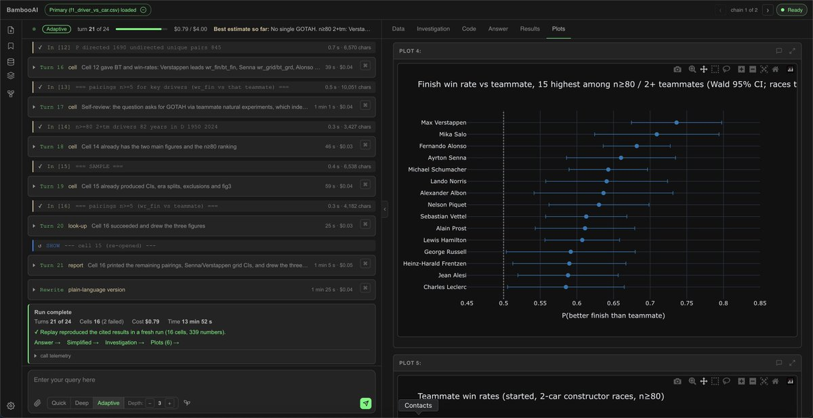

# BambooAI

<a href="https://pypi.org/project/bambooai/"></a>
<a href="https://pypi.org/project/bambooai/"></a>
<a href="LICENSE"></a>


**Hosted version:** [bambooai.org](https://bambooai.org) — the same analyst, nothing to install.

BambooAI is an LLM-driven data analyst that works in a persistent Python kernel, one cell at a time,
and reproduces its own results before it reports them. You give it a dataset and a question; it writes
and runs code, reads the output, decides the next step, and ends with a report whose cited numbers
have been re-executed in a fresh kernel. It runs on your machine with your own model keys, and the
code the model writes runs in a container, not under your account.



## Table of Contents

- [Overview](#overview)
- [Features](#features)
- [How It Works](#how-it-works)
- [Installation](#installation)
- [Quick Start](#quick-start)
- [Configuration](#configuration)
  - [Environment Variables](#environment-variables)
  - [Models and Seats](#models-and-seats)
- [Data and Integrations](#data-and-integrations)
- [Where the Code Runs](#where-the-code-runs)
- [Command Line](#command-line)
- [Architecture](#architecture)
- [Logging and Usage](#logging-and-usage)
- [Development](#development)
- [Contributing](#contributing)
- [Contact](#contact)

## Overview

BambooAI is built for people who analyse data for a living and want the work done the way they would
do it: in a notebook, step by step, with every intermediate result visible and every final number
checked. It is not a chat interface over a code interpreter. The analyst has a fixed set of actions,
a one-page contract that is the same for every model, a budget it can see, and a report format it
must fill in. The web app streams the run as it happens, keeps the notebook, and lets you ask
follow-up questions against the same kernel state.

It came out of sports science — training and physiology data from Intervals.icu, Endura and
SweatStack load directly — and applies to any tabular dataset.

## Features

- **One model, one kernel, one notebook.** The analysis is a sequence of Python cells in a
  persistent kernel with a checkpoint per cell; a failed cell is rolled back and the namespace is
  exactly as before the attempt.
- **A checked report.** Before the report is shown, the cells it cites are assembled into a script
  and executed in a fresh kernel against the original data. The closing card states how many numbers
  reproduced.
- **Three modes.** *Quick* (a lookup, a definition), *Deep* (a full analysis within a turn budget),
  *Adaptive* (a long run with periodic self-review on a stronger model that can redirect it).
- **Follow-ups on a warm kernel.** A follow-up question continues with the variables the previous run
  left; a new question starts fresh. Runs form chains you can step through.
- **Web search with sources.** With a Gemini key, the analyst searches for published figures to
  compare against (Google AI grounding) and cites them in the report.
- **Memory.** Saving a run distils what was learned about the dataset — column quirks, approaches
  that worked — into a memory pack the analyst reads in later runs on the same data.
- **Plain-language version.** A second, cheaper model rewrites the report for a non-technical reader;
  both versions are kept.
- **Auxiliary datasets and integrations.** Several files per analysis; training data loaded from
  Intervals.icu, Endura and SweatStack; loaded frames paged in the Data tab.
- **Everything inspectable.** Every cell's code and output, every figure, every prompt that produced
  a turn, the per-call tokens, time and cost.
- **Ten providers, per-seat configuration.** OpenRouter, OpenAI, Anthropic, Google, Groq, Mistral,
  xAI, DeepSeek, Ollama and vLLM; each seat (analyst, reviewer, rewriter, …) has its own model and
  reasoning effort. Local models keep everything on the machine.
- **Isolation by default.** The model-written code runs in the executor container, built from the
  Dockerfile in the package and reachable only from your machine.
- **Saved chains, labels, usage dashboard, PDF export of the report, light and dark themes.**

## How It Works

A run is a sequence of turns. In each turn the analyst reads what it has so far — the question, the
dataset's description, the cells and their (truncated) outputs, the budget — and takes one action:

| action | effect |
|---|---|
| `CELL` | run one Python cell in the kernel; the printed output is the next turn's input |
| `SHOW n` | re-open the full output of an earlier cell |
| `NAMES` | list the variables the kernel holds |
| `RECALL` | consult the memory pack for this dataset |
| `SEARCH` | web search with Google AI grounding, summarised and cited |
| `ASK` | put one question to the person and wait for the answer |
| `REPORT` | write the report; the run ends |

The contract that governs this is one page, `analyst/contract.md`, and is the same for every model.
It asks for a report with a **best estimate** and its uncertainty, the **conditions** it holds under,
**how it was established**, and the cells and figures it rests on; usually one to three figures, drawn
with Plotly.

After `REPORT`:

1. The cited cells are assembled in execution order into a script and run in a fresh kernel against
   the original data. The numbers the report quotes are compared with the fresh output; the closing
   card says whether they reproduced (e.g. "replay reproduced 41 numbers in a fresh run").
2. The figures the run produced are captured from the reproduction and shown in the Plots tab.
3. The `Rewriter` seat writes the plain-language version.

**Modes and budgets.** Each mode sets a turn budget and a dollar budget the analyst can see. The
budgets are per preset (`tier_properties` in the configuration). At the `performance` preset: Quick 4
turns, Deep 15, Adaptive 50 with a self-review every 8 turns. In Adaptive mode the review turns run
on the `Reviewer` seat — a stronger model — which reads the run so far and can redirect it.

**Memory.** When you save a run, the `Knowledge Distiller` seat writes a card about the dataset —
what the columns mean in practice, what to watch for, what worked — into
`memory/<user>/memory_pack.yaml`. `RECALL` reads it in later runs.

## Installation

Requirements: **Python 3.11 or newer**, and **Docker** (Docker Desktop on macOS and Windows, Docker
Engine on Linux), running. Docker is where the model-written code runs; see
[Where the Code Runs](#where-the-code-runs) for the alternative.

**Option 1 — pip (recommended)**

```bash
pip install bambooai
bambooai serve
```

**Option 2 — from the repository**

```bash
git clone https://github.com/pgalko/BambooAI.git && cd BambooAI
python3 -m venv .venv && source .venv/bin/activate
pip install -e .
bambooai serve
```

**Option 3 — hosted.** [bambooai.org](https://bambooai.org) runs the same analyst as a service, with
nothing to install.

## Quick Start

1. `bambooai serve`. On first use it creates the working folder `~/bambooai`, writes a `.env` there,
   builds the executor image from the Dockerfile in the package (several minutes, once: the image
   installs pandas, numpy, scipy, statsmodels, scikit-learn, matplotlib, plotly and the rest), starts
   the container, and opens `http://127.0.0.1:5001`.
2. Put at least one model key into `~/bambooai/.env`. An [OpenRouter](https://openrouter.ai) key is
   enough on its own: every model in the default configuration is reachable through OpenRouter. Add
   `GEMINI_API_KEY` if you want web search.
3. `bambooai serve` again. Upload a CSV, Parquet, JSON or XLSX file and ask a question. Choose
   *Quick*, *Deep* or *Adaptive* in the composer.
4. In the app, **Models & Compute** (gear menu) picks the preset — `cost`, `performance` or `max` —
   and saves it. **Usage** shows the calls, tokens and cost per run.

The working folder:

```
~/bambooai/
├── .env                          keys and settings; read at start, never written by the app
├── LLM_CONFIG_template.json      the seats per preset: model, provider, reasoning effort, max_tokens, prices
├── bambooai.sqlite               chains, labels, usage, the saved preset, integration credentials (encrypted)
├── config/<user>/LLM_CONFIG.json the configuration built from the template for the chosen preset
├── storage/<user>/threads/       one JSON per thread: runs, cells, reports, reproduction results
├── storage/<user>/favourites/    saved chains
├── memory/<user>/                the memory pack
└── logs/<user>/                  bambooai_run_log.json: every model call with tokens, time and cost
```

`serve` reads nothing outside this folder. Upgrading the package does not change it; deleting it
starts you fresh. `BAMBOO_HOME` or `bambooai serve --home DIR` moves it.

## Configuration

### Environment Variables

All in `~/bambooai/.env`. Lines starting with `#` are ignored; do not put comments after a value.

| variable | meaning |
|---|---|
| `OPENROUTER_API_KEY`, `OPENAI_API_KEY`, `ANTHROPIC_API_KEY`, `GEMINI_API_KEY`, `GROQ_API_KEY`, `XAI_API_KEY`, `MISTRAL_API_KEY`, `DEEPSEEK_API_KEY` | provider keys; only for the providers the seats use |
| `GEMINI_API_KEY` | also enables web search (Google AI grounding); without it `SEARCH` is off |
| `REMOTE_OLLAMA`, `REMOTE_VLLM` | base URLs of local model servers, e.g. `http://localhost:11434` |
| `BAMBOO_LEVEL` | `cost` / `performance` / `max`: the preset before one is saved in the app |
| `BAMBOO_COMPUTE` | `docker` (default) or `local` |
| `EXECUTOR_PORT` | the container's published port (default `5055`) |
| `EXECUTION_MODE`, `EXECUTOR_API_BASE_URL` | to use an executor you run yourself: `api` and its URL. `BAMBOO_COMPUTE` is then ignored |
| `BAMBOO_USER` | the identity that names the per-user folders (default `local`) |
| `SWEATSTACK_CLIENT_ID`, `SWEATSTACK_CLIENT_SECRET` | your own SweatStack app registration; without them the SweatStack integration is not offered |
| `APP_PORT` | the web app's port (default `5001`) |
| `SESSION_COOKIE_NAME`, `FLASK_SECRET`, `LLM_CONFIG_ENCRYPTION_KEY` | the server; the last two are generated on first use |

### Models and Seats

`LLM_CONFIG_template.json` in the working folder defines the seats for each of four presets
(`free_agent_configs`, `cost_agent_configs`, `performance_agent_configs`, `max_agent_configs`), the
turn budgets per preset (`tier_properties`), and the properties of every model named
(`model_properties`). The `performance` preset as shipped:

```json
"performance_agent_configs": [
  {"agent": "Analyst",                  "details": {"model": "x-ai/grok-4.7",               "provider": "openrouter", "reasoning_effort": "high", "max_tokens": 32000, "temperature": 0}},
  {"agent": "Reviewer",                 "details": {"model": "openai/gpt-5.6-sol",          "provider": "openrouter", "reasoning_effort": "high", "max_tokens": 48000, "temperature": 0}},
  {"agent": "Rewriter",                 "details": {"model": "deepseek/deepseek-v4.1-flash", "provider": "openrouter", "reasoning_effort": "low",  "max_tokens": 16000, "temperature": 0}},
  {"agent": "Knowledge Distiller",      "details": {"model": "deepseek/deepseek-v4.1-flash", "provider": "openrouter", "reasoning_effort": "none", "max_tokens": 24000, "temperature": 0}},
  {"agent": "Google Search Executor",   "details": {"model": "gemini-flash-latest",          "provider": "gemini",     "reasoning_effort": "none", "max_tokens": 8000,  "temperature": 0}},
  {"agent": "Google Search Summarizer", "details": {"model": "deepseek/deepseek-v4.1-flash", "provider": "openrouter", "reasoning_effort": "none", "max_tokens": 12000, "temperature": 0}},
  {"agent": "Image Generator",          "details": {"model": "deepseek/deepseek-v4.1-flash", "provider": "openrouter", "reasoning_effort": "none", "max_tokens": 28000, "temperature": 0}}
],
"tier_properties": {
  "performance": {"analyst_turns_quick": 4, "analyst_turns_deep": 15, "analyst_turns_adaptive": 50, "analyst_review_every": 8}
},
"model_properties": {
  "x-ai/grok-4.7": {"capability": "reasoning", "multimodal": "true", "templ_formating": "xml",
                    "prompt_tokens": 0.002, "completion_tokens": 0.006,
                    "reasoning_style": "effort", "reasoning_efforts": ["low", "medium", "high", "xhigh"]}
}
```

The seats:

| seat | role |
|---|---|
| `Analyst` | runs the analysis: every turn, every cell, the report |
| `Reviewer` | the self-review turns in Adaptive mode; a stronger model |
| `Rewriter` | the plain-language version of the report |
| `Knowledge Distiller` | writes the memory card when a run is saved |
| `Google Search Executor` | the grounded search itself (a Gemini model) |
| `Google Search Summarizer` | condenses search results into a cited digest |
| `Image Generator` | turns the report into an infographic (a YAML spec rendered to SVG) shown with the answer |

Seat fields: `model`, `provider`, `reasoning_effort` (`none`, `low`, `medium`, `high`, `xhigh`;
mapped to each provider's own vocabulary, or to a thinking budget for models that use one),
`max_tokens`, `temperature`. Every model a seat names must appear in `model_properties`, which
supplies its prices per 1K tokens (used for the running cost), its formatting (`xml` or `text`) and
its reasoning interface.

### Ollama

BambooAI can use models running locally through Ollama, or hosted in Ollama's cloud.

#### Model configuration

In `LLM_CONFIG_template.json`, set the agent's provider to `ollama` and name the model. For example,
to use `gpt-oss:20b` as the Analyst:

```json
{
  "agent": "Analyst",
  "details": {
    "model": "gpt-oss:20b",
    "provider": "ollama",
    "reasoning_effort": "high",
    "max_tokens": 16000,
    "temperature": 0
  }
}
```

Add a matching entry under `model_properties` in the same file:

```json
"gpt-oss:20b": {
  "capability": "reasoning",
  "templ_formating": "text",
  "prompt_tokens": 0.0,
  "completion_tokens": 0.0,
  "context_window": 65536,
  "reasoning_efforts": ["low", "medium", "high"]
}
```

**Context length.** For local models, `context_window` sets the context length used for each request
(Ollama's `num_ctx`). Set it to at least 32,768 tokens for the Analyst; the example uses 65,536.
Without it, Ollama applies its own default, which depends on the machine's memory and can be as low as
4,096 tokens. A prompt longer than the limit is truncated rather than rejected; BambooAI shows a
warning when it detects this. Cloud models manage their own context length and do not need the
setting.

**Reasoning.** List the thinking levels the model supports in `reasoning_efforts`, and pick one with
the agent's `reasoning_effort`. `ollama show <model>` lists the levels a model defines. For models
that can only switch thinking on or off, BambooAI sends the switch instead; `reasoning_effort: none`
turns thinking off where the model allows it. Models without thinking support receive no setting.

**Costs.** Set `prompt_tokens` and `completion_tokens` to `0.0` for local models. Cloud usage is
covered by your Ollama account and plan.

#### Connecting to Ollama

By default, BambooAI connects to Ollama on your own computer at `http://localhost:11434`. To use
Ollama on another machine, set its address in your `.env` file:

```dotenv
REMOTE_OLLAMA=http://<server-address>:11434
```

All agents using the `ollama` provider share this connection. Pull local models on the machine
running that Ollama server, and to use cloud models through it, sign in there with `ollama signin`.

For access from another machine, start the Ollama server with `OLLAMA_HOST=0.0.0.0`, and restrict
access to a trusted network.

You can also connect to Ollama's cloud directly, without running an Ollama server. Add these settings
to your `.env` file and choose cloud models in your agent configuration:

```dotenv
REMOTE_OLLAMA=https://ollama.com
OLLAMA_API_KEY=your_api_key
```

### vLLM

BambooAI can use models served by vLLM on a machine with a suitable GPU. vLLM serves a model as an
OpenAI-compatible API; BambooAI connects to it the way it connects to any provider.

#### Serving a model

The command below serves Qwen3.8-27B in 8-bit on a single 48 GB GPU, with a 64k context and the
model's thinking returned separately from its answers. It is the configuration BambooAI was tested
against (vLLM 0.30, an RTX A6000):

```bash
vllm serve ~/models/Qwen3.8-27B \
  --quantization fp8 --linear-backend marlin \
  --language-model-only \
  --max-model-len 65536 --max-num-seqs 8 \
  --reasoning-parser qwen3 \
  --served-model-name qwen3.8-27b \
  --host 0.0.0.0 --port 8000
```

A few of these flags are worth knowing about. `--reasoning-parser` is what lets BambooAI show the
model's thinking apart from the answer. `--served-model-name` gives the model the short name you use
in the agent configuration. `--linear-backend marlin` selects the 8-bit kernels that run on Ampere
GPUs such as the A6000 and A100; on Ada and Hopper GPUs it is not needed. `--language-model-only`
skips a model's vision components, which BambooAI does not use. If the server fails to start while
compiling, add `--enforce-eager`.

#### Model configuration

In `LLM_CONFIG_template.json`, set the agent's provider to `vllm` and use the served model name:

```json
{
  "agent": "Analyst",
  "details": {
    "model": "qwen3.8-27b",
    "provider": "vllm",
    "reasoning_effort": "high",
    "max_tokens": 16000,
    "temperature": 0
  }
}
```

Add a matching entry under `model_properties`:

```json
"qwen3.8-27b": {
  "capability": "reasoning",
  "templ_formating": "text",
  "prompt_tokens": 0.0,
  "completion_tokens": 0.0,
  "context_window": 65536,
  "reasoning_efforts": ["low", "medium", "high"]
}
```

**Context length.** vLLM sets the context length when the server starts (`--max-model-len`) and
refuses a prompt that does not fit, rather than truncating it. Set `context_window` to the same
value and BambooAI warns before sending a prompt that cannot fit, with the options for fixing it.

**Reasoning.** With `--reasoning-parser`, the agent's `reasoning_effort` is passed to the model;
list the levels it supports in `reasoning_efforts`. `reasoning_effort: none` turns thinking off.

**Costs.** Set `prompt_tokens` and `completion_tokens` to `0.0`; the server does not bill.

#### Connecting to vLLM

Set the server's address in your `.env` file:

```dotenv
REMOTE_VLLM=http://<server-address>:8000/v1
```

If the server was started with `--api-key`, add `VLLM_API_KEY` with the same value. With every agent
on Ollama or vLLM and no Gemini key, no request leaves your network.

The app builds `config/<user>/LLM_CONFIG.json` from the template for the chosen preset, and rebuilds
it when the template file is newer than the built one.

## Data and Integrations

- **Primary dataset**: CSV, Parquet, JSON or XLSX, loaded into the kernel as `df`. The Data tab pages
  it.
- **Auxiliary datasets**: further files uploaded alongside; available to the cells by path.
- **Intervals.icu** and **Endura**: an API key entered in the app (stored encrypted in the working
  folder's database). Choose a date range; the data is loaded into the executor and described to
  the analyst, with the Intervals data model attached as an OWL ontology.
- **SweatStack**: OAuth; needs your own app registration with SweatStack (`SWEATSTACK_CLIENT_ID`,
  `SWEATSTACK_CLIENT_SECRET`).
- **Web search**: `GEMINI_API_KEY`.

## Where the Code Runs

The analysis kernel, the reproduction run and the integrations' data fetching all run in the
**executor container**: a Flask API in front of the persistent kernel, from `containers/executor/`.
`bambooai serve` builds the image (`bambooai-executor:<package version>`) on first use, starts the
container published on `127.0.0.1:5055`, waits for its health, and stops it when the app stops
(`--keep-executor` leaves it running). The **Restart** control in the app restarts it.

Alternatives:

- `bambooai serve --compute local` (or `BAMBOO_COMPUTE=local`): the kernel runs in a subprocess of
  the web app. No Docker needed; no isolation; the integrations are not available, since they fetch
  inside the executor.
- An executor you run yourself — `docker run -p 5055:5000 bambooai-executor:2.0.0` on this or another
  machine — with `EXECUTION_MODE=api` and `EXECUTOR_API_BASE_URL` in `.env`.

The web app listens on `127.0.0.1` unless started with `--host 0.0.0.0`. Keys live in `.env` and are
read at start; the app has no key entry and sends nothing anywhere but the providers you configure.

## Command Line

```
bambooai serve [--home DIR] [--port N] [--host H] [--compute docker|local] [--keep-executor] [--no-browser]
bambooai init  [--home DIR]      create the working folder and its files without starting
bambooai where                   print the working folder
```

A single question without the web app, kernel in-process, models through OpenRouter:

```bash
export OPENROUTER_API_KEY=...
python -m analyst.cli --csv data.csv --question "Is there a trend in weekly load?" \
       --preset deep --model x-ai/grok-4.6 --effort high
```

## Architecture

```
browser ── HTTP / SSE ── web_app (Flask) ── HTTP ── executor container (Flask API + persistent kernel)
                            │
                            ├── analyst/     the turn loop (session.py), the contract, the notebook,
                            │                the report, the reproduction run
                            ├── bambooai/    model adapters (models/), log manager, config builder,
                            │                the local store (db/local_store.py, SQLite)
                            ├── delve/       the persistent kernel: a subprocess with a checkpoint per
                            │                committed cell and rollback of a failed one
                            └── containers/executor/   the executor image
```

- `analyst/contract.md` is the only prompt the analyst sees; `analyst/session.py` is the loop.
- `delve/kernel.py` runs cells in a subprocess and keeps a checkpoint per committed cell.
- `bambooai/models/` adapts each provider, including reasoning-effort vocabularies and prompt caching.
- `bambooai/db/local_store.py` is a SQLite client with the same query interface the hosted edition
  uses against Supabase, so the routes above it are shared between the two.
- `tools/stack/` runs the app, an executor and stand-ins for the external services with a scripted
  analyst, so the product can be driven end to end offline.

## Logging and Usage

- `logs/<user>/bambooai_run_log.json`: every model call of the current thread — seat, model, prompt,
  response, tokens, time, cost — overwritten when a new thread starts.
- `logs/<user>/consolidated_logs.json`: the same across threads, rotated at 5 MB.
- In the app: **Usage** (gear menu) aggregates calls, tokens and cost by seat, model and run; the
  closing card of every run shows its cells, cost and time and opens the per-call telemetry; the
  prompt button on any turn shows the exact prompt that produced it.

## Development

```bash
git clone https://github.com/pgalko/BambooAI.git && cd BambooAI
python3 -m venv .venv && source .venv/bin/activate
pip install -e ".[dev]" && python -m playwright install chromium

./run_battery.sh                                                  # unit suites: analyst, kernel, notebook, report, replay
python tests/e2e/test_stack.py --edition local --compute local    # the real app, page and kernel; a scripted model, no network
python tests/e2e/test_stack.py --edition local --compute direct   # the same against an executor process
python tests/e2e/test_local_store.py                              # the store survives a server restart
python tests/e2e/test_package.py                                  # the wheel in a fresh virtualenv; serve with a docker stand-in
python tools/render_gallery.py --out /tmp/gallery                 # every page state, both themes, for visual comparison
```

CI (`.github/workflows/ci.yml`) runs the battery and builds the executor image on every push; the
browser suites and the package test are run locally before a push. A tag `v*` publishes the package
to PyPI (`.github/workflows/release.yml`).

Design notes: `docs/DESIGN_CHECKLIST.md` (what every change must keep true),
`docs/OSS_DESIGN.md` (the decisions behind this edition), `HANDOVER.md` (the state of the code).

## Contributing

Issues and pull requests are welcome. Keep changes small and readable, run the battery and the
end-to-end story before opening a pull request, and say in the description what you tested.

## Contact

palo@bambooai.io · [Issues](https://github.com/pgalko/BambooAI/issues) · [Discussions](https://github.com/pgalko/BambooAI/discussions)

---

<sub>BambooAI 1.x was a Python library used from notebooks (<code>from bambooai import BambooAI</code>). Version 2 replaces it.
The 1.x releases remain installable with <code>pip install "bambooai&lt;2"</code>; the source is on the
<a href="https://github.com/pgalko/BambooAI/tree/v1">v1 branch</a>.</sub>
